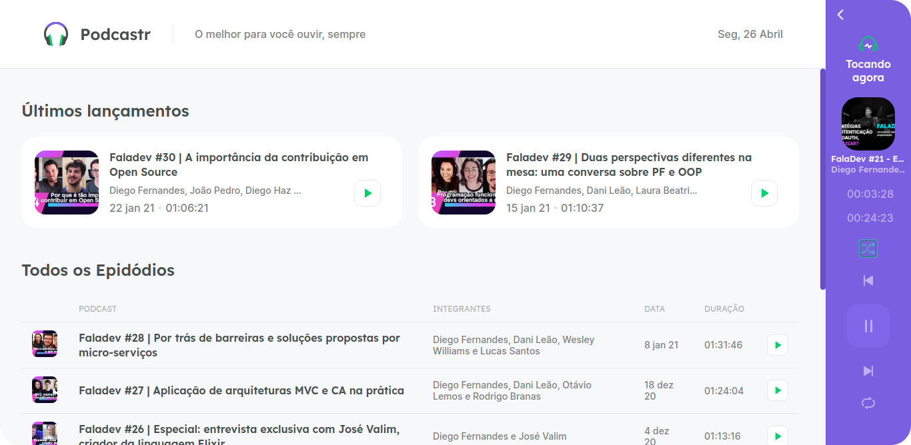
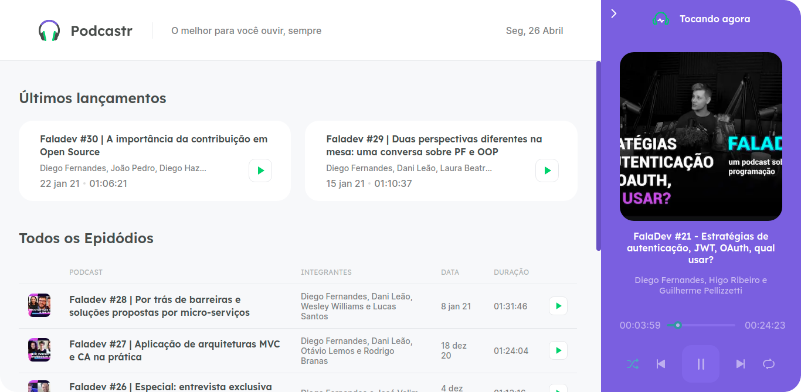

  
  <h3 align="center">Aplicação desenvolvida durante no NLW #5</h3>

#

## Sobre o projeto
A aplicação se trata de uma plataforma de podcasts sobre tecnologia. Consumindo uma API, utilizando o NEXT para toda a aplicação.

## Previews

## Tecnologias Utilizadas
- Next;
- React;
- Typescript;
- Html;
- CSS;